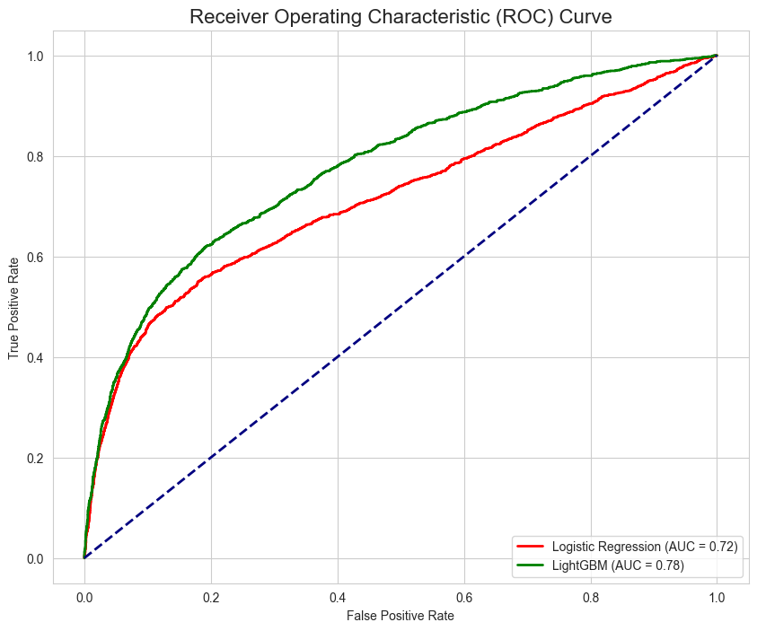

# Predictive Credit Scoring & Default Prediction

### Project Overview

This project tackles one of the most critical challenges in the fintech industry: **predicting credit default.** Using a real-world dataset of 30,000 credit card clients, this project demonstrates an end-to-end machine learning workflow, from initial data exploration to model evaluation.

The primary goal is to build a reliable predictive model that can assess the probability of a client defaulting on their next payment, enabling a lending business to make smarter, data-driven credit decisions.

-----

### The Business Problem

Credit default poses a significant financial risk to any lending institution. With a **22% default rate** in this dataset, it's clear that accurately identifying high-risk applicants is not just an analytical exercise—it's a business necessity. An automated and accurate credit scoring model can:

  * **Reduce Financial Losses** by flagging high-risk applicants before credit is extended.
  * **Increase Efficiency** by automating the approval process for low-risk clients.
  * **Improve Decision Making** by providing a consistent, data-driven risk score.

-----

### Key Features & Accomplishments

  * **Exploratory Data Analysis (EDA):** Performed a deep-dive analysis to identify the key drivers of credit default, uncovering strong correlations between payment history, credit limit, and default probability.
  * **Data Cleaning & Preparation:** Executed a robust data cleaning and preprocessing workflow, including handling missing values and feature scaling.
  * **Model Building & Comparison:** Trained and evaluated two machine learning models: a Logistic Regression baseline and a more advanced **LightGBM** classifier.
  * **Advanced Model Evaluation:** Went beyond simple accuracy, using professional evaluation metrics including **Confusion Matrices, Classification Reports (Precision/Recall), and the AUC-ROC curve** to select the best-performing model for this specific business problem.

-----

### Data Source

The dataset used is the "Default of Credit Card Clients" dataset, a popular and realistic dataset for credit scoring tasks. It contains demographic and past payment data for 30,000 credit card clients in Taiwan.

  * **Direct Link to Data:** [https://archive.ics.uci.edu/dataset/350/default+of+credit+card+clients]

-----

### Key Findings & Actionable Insights

#### Insight 1: Recent Payment History is the Strongest Red Flag

The analysis clearly shows that a client's payment status in the most recent month (`PAY_1`) is a powerful predictor of default. The longer the delay, the exponentially higher the chance of default. This feature should be heavily weighted in any risk model.


#### Insight 2: Lower Credit Limits Correlate with Higher Risk

Clients who defaulted had a significantly lower median credit limit than those who did not. This suggests that `LIMIT_BAL` is a key variable in assessing risk and that the bank's existing credit allocation may already be identifying some level of risk.


-----

### Machine Learning Model Performance

Two models were built and compared. While the Logistic Regression model provided a solid baseline, the **LightGBM model was the clear winner.**

The LightGBM model achieved a superior **AUC score of 0.78** and demonstrated a much better balance of Precision and Recall for identifying the "Default" class. This is crucial for a lending business, as it is more effective at catching high-risk applicants (higher recall) without incorrectly flagging too many good applicants.



This model can be used to generate a reliable risk score for every new applicant, enabling the business to automate and improve its credit decisions.

-----

### How to Run This Project

1.  **Clone the repository:**
    ```bash
    git clone https://github.com/Ogezi-Emmanuel/predictive-credit-scoring.git
    cd predictive-credit-scoring
    ```
2.  **Set up the environment:**
      * It is recommended to use a virtual environment.
      * Install the required libraries:
        ```bash
        pip install -r requirements.txt
        ```
3.  **Run the Jupyter Notebook:**
      * Launch Jupyter Notebook and open the `Predictive Credit Scoring.ipynb` file.

-----

### About Me

[Emmanuel Sunday Ogezi]

  * **LinkedIn:** [www.linkedin.com/in/emmanuel-ogezi-2501932b6]
